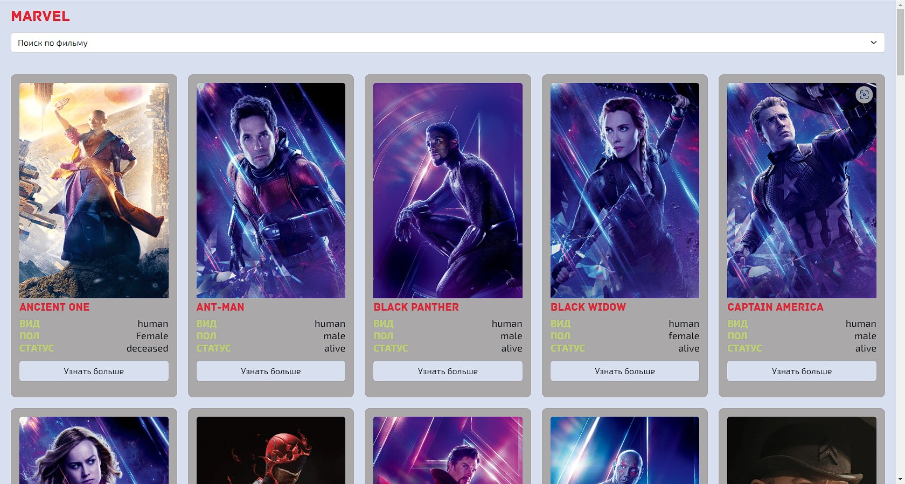
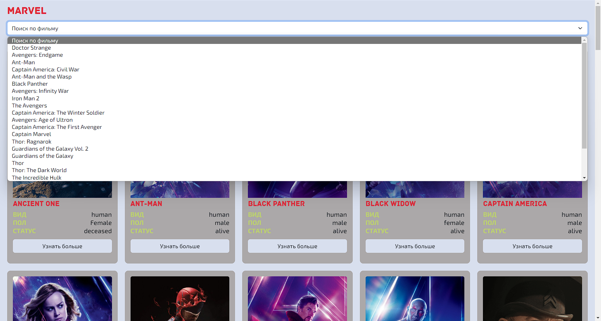

# Герои Marvel :star2: :collision:

:point_right: **Ссылка на просмотр проекта** - https://demensferre.github.io/heroes/ :point_left:

---

**_Скриншоты состояний преокта:_** :point_down:

---

## Немного о проекте

:muscle: **heroes** - это мой мини-проект на котороый я на самом деле потратил не мало времени, так как использовал здесь fetch и асинхронные функции, рендер элементов на страницу. Так же использовал в этом проекте JS, HTML5 и CSS3. :blush:

---

## Как запустить проект на своем ПК

- Клонируем git-репеозиторий к себе - `git clone https://github.com/DemensFerre/qr-generate.git`

- Заходим в проект и запускаем любой локальный серевер ( Например live server в VS Code )
